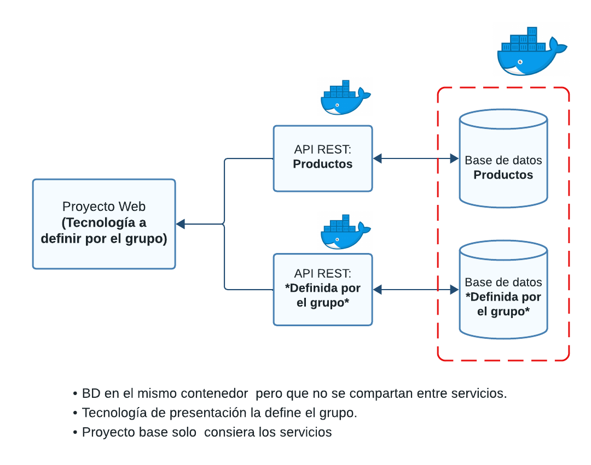
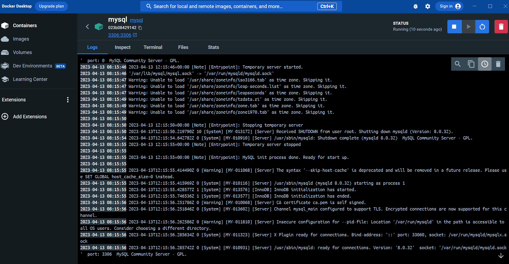
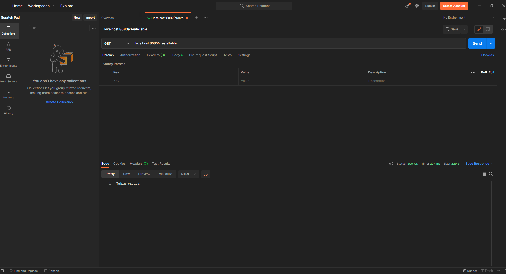

# INF236-2023-1-Proyecto Base

## Requerimientos

Para utilizar el proyecto base debe tener instalado [Node.js](https://nodejs.org/en), [Docker](https://www.docker.com/) y se recomienda [Postman](https://www.postman.com/) para poder probar los endpoints de la api.

## Puntos a Considerar
La solución a desarrollar debe seguir los siguientes lineamientos (imagen referecial al final):
* Se debe considerar dos API's:
    * API_PRODUCTOS: Con todo lo referido a los productos.
    * API_{DEFINIR}: con todo lo referido al microservicio que haya definido el grupo.
* Cada API contará con una base de datos mysql.
* Las API's deben ser construidas utilizando [Node.js](https://nodejs.org/en)

## Levantando el proyecto
### Bases de Datos
Iniciaremos levantando la imagen de mysql en docker. En una terminal escriba el siguiente comando:
```
docker run -p 3306:3306 --name mysql -e MYSQL_ROOT_PASSWORD=password -d mysql
```
Deben esperar a que se inicie en su totalidad el contenedor. Pueden verificar esto en la interfaz de Docker. Si utilizan el comando que sigue sin esperar les mostrará un error.


Una vez creada la imagen, crearemos las bases de datos. Para esto debemos entrar en el contendor, con el siguiente comando:
```
docker exec -it mysql mysql -uroot -p
```
Deben ingresar la clave que en este caso es **password**

Una vez dentro del contenedor podemos crear las bases de datos. 
```
create database Nombre;
```
Donde Nombre, deberá ser sustituido por: BDXX_PRODUCTOS, BDXX_{DEFINIR}, donde XX corresponde al número de su grupo.

### API's
Deben crear un archivo con el nombre .env en la carpeta API_PRODUCTOS. Este debe contener lo siguiente:
```js
PORT_API = 8080
DB_USER = "root"
DB_PASSWORD = "password"
DB_NAME = "Nombre de la base de datos"
DB_PORT = 3306
DB_HOST = "host.docker.internal"
```
***Nota: deben cambiar DB_NAME por el nombre que le pusieron a la base de datos (BDXX_PRODUCTOS)***

Una vez creado el archivo, deben ir a la terminal (deben estar dentro de la carpeta API_PRODUCTOS) y levantar el contenedor
```
docker-compose up --build -d
```
Una vez levantado deberían poder ver en docker sus contenedores corriendo, pueden probar el siguiente end-point en postman para verificarlo.
```
GET: localhost:8080/createTable
```


**Deben replicar este proceso para la API_{DEFINIR}.**

### Enjoy!

